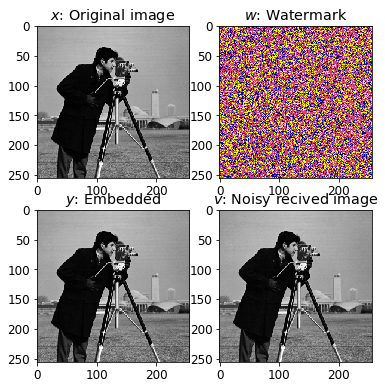
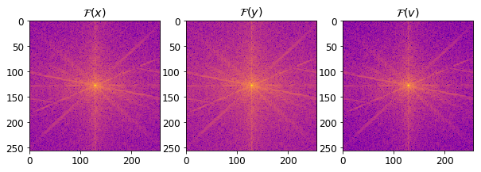
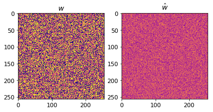
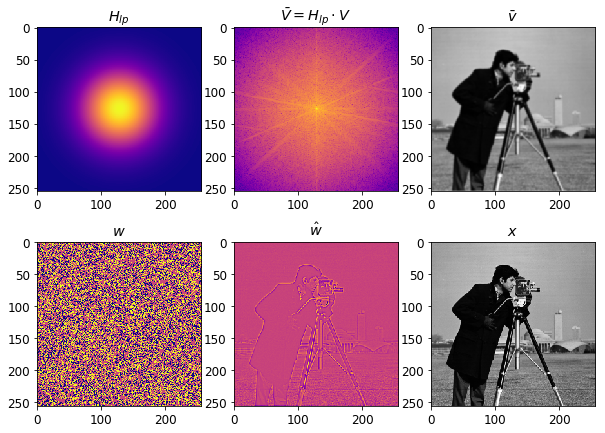
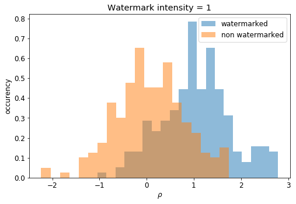
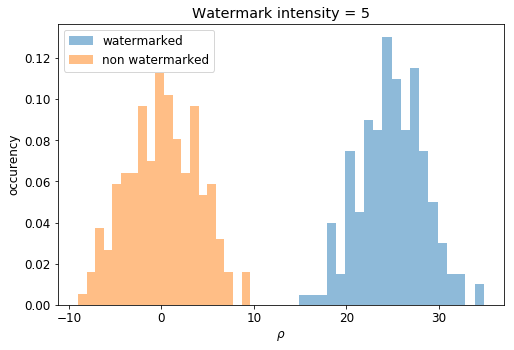
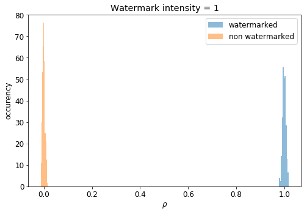
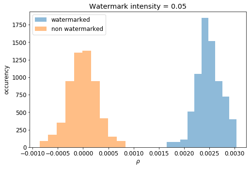
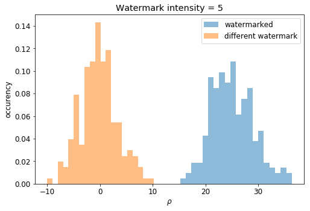

# Watermark Detection
**Martino Ferrari**

## Watermark Embedding and Channel modelling

After loading a gray scale image $x$ we were asked to embed a watermarm $w$ composed by $\{-1,+1\}$ uniformly distributed with a density of $θ_N=0.5$, $y=x+w$. The image is then *attacked* by an AWGN $z=\mathcal{N}(0,1)$, the resulting image $z=y+z$.

The process is shown in the previous figure, to the human eyes is very difficult to see any diffrence between the 3 images $x$, $y$ and $v$ as both the watermark and the noise have low intensity. I tried so to see if in the frequency domain the difference is more evident. 

The diffrence is small as well in the frequency domain, however is possible to see the effects of the gaussian noise in the last sub plot.

## Non-blind watermark detection

In this simple detection case we suppose that the reciver has access to the original image $x$ and of course the key to generate the watermark $w$. The first step is so to extract the $\hat{w}=v-x$, and then compute the corelation of it with the original watermark $\rho=\frac{1}{N}\sum_{i=0}^{N-1}\hat{w}[i]\cdot w[i]$:

The correlation between the two signali is:
$$\rho_{non-blind} = 1.01$$

## Blind watermark detection

However in general the reciver doesn't have access to the original image, in this case the extraction of the watermark $\hat{w}$ is done using an extimation of the original image $\bar{v}$, $\hat{w}=v-\bar{v}$. As both $z$ and $w$ can be represented as noise the extimation $\bar{v}$ can be computed using a low pass filter $\bar{v}=h_{lp}*v$ or in the frequency domain as $\bar{V}=H_{lp}\cdot V$.

Using a very weak low pass filter $H_{lp}=10^{-\frac{u^2}{2\cdot80^2}}$ is possible to obtain very good results. Using a stronger low pass filter will give worst results as the $\hat{w}$ will be dominate by the high-frequncy of the original image $x$, instead that on the watermark $w$ (and noise $z$). Is possible now to compute again the correlation $\rho$ as before:

$$\rho_{blind} = 0.88$$

The difference between $\rho_{non-blind}=1.01$ and $\rho_{blind}=0.88$ is very small and that confirms the graphical evidence as well as the filter choice. However with stronger noise $z$ or more sofisticate attack (e.g.: the attacker could use the same filter to compute $\hat{w}$ and then substracting it to the image $y$) could affect more the watermark detection.

## Statistical analysis

To understand better how the simple blind detector implemented perform I chose to do some statistical analysis confronting 200 watermarked images with 200 not watermarked and looking at the value of the correlation between $w$ and $\hat{w}$:

With a watermark intensity of only 1 is very hard distinguish from the noisy images and the watermarked one, however increasing the inteinsity up to 5 will give already very good performance with close to no overlap between the two distribution:

For the **non-blind watermark detector** I'm exepecting much better performances:

The difference of performance between the **blind** and **non-blind** detectors are remarkables, to stress the system I then tied to increase the noise:

It results that the **blind** and **non-blind** detector have similar performance with a difference of watermark intensity of a factor 100 (intensity 0.05 is equivalent to 5).

As final test  I wanted to see how the detectors performs with image watermarked with a different watermark that the one tested:

As I was expecting there is no much difference between noise and a false watermark for the detector as the two watermarks are indipendent, $w_0\perp w_1$.

