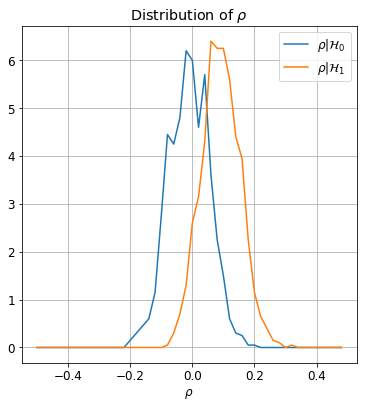
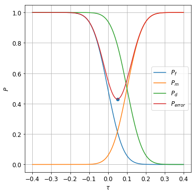
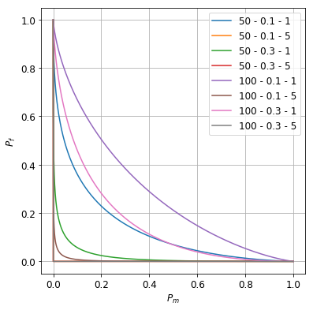
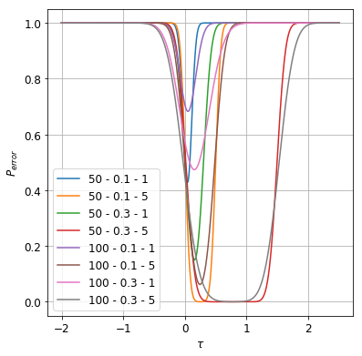
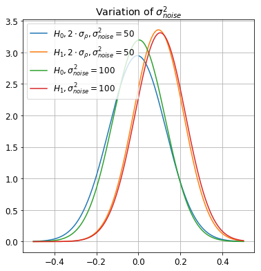
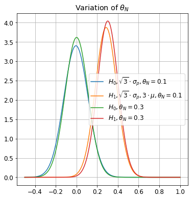
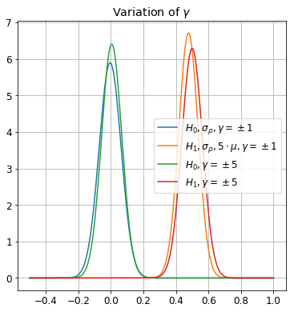
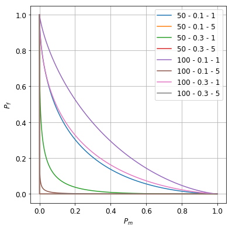
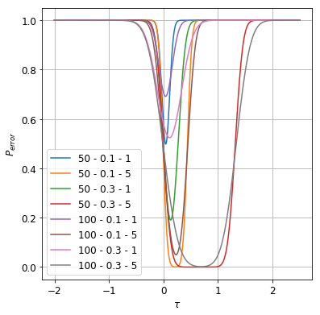

# Watermark performance evaluation
**Martino Ferrari**

## Non-blind watermark detection

#### Exercise 1.1

For the given hypotesis:

$$
\begin{cases}
    \mathcal{H}_0:\quad v = x+z \\
    \mathcal{H}_1:\quad v = x+w+z
\end{cases}
$$

where $x$ is the host image, $w$ is the watermark and $z$ is a noise with distribution: $\mathcal{N}(0,\sigma_{noise}^2)$.    
Compute numerically the following property:

 - $P_f$
 - $P_m$
 - $P_d$
 

    mean(rho|H0): 0.002
    mean(rho|H1): 0.098
    variance(rho|H0): 0.004
    variance(rho|H1): 0.004

As expected the variance of the two distribution is very similar (asintoticaly is the same) as it depends only by the image size. Instead the mean of $\rho|\mathcal{H}_0$ depends from the intensity $\gamma$ of the watermark.

Using this information is now possible to compute the threshold $\tau$ as well as displaying the different probabilities depending on the treshold.

    tau: 0.050
    Pf: 0.210
    Pm: 0.209
    Pd: 0.791
    Pe: 0.420

Using the Bayess hypotesis, the treshold $\tau$ can be found in the middle point (0.05) of the two distirbution (as the two hyptesis are equiprobable and have same variance). This is also shown in the figure above, as is in the middle point where the $P_{error}$ is minimal.

The resulting probabilities are:

 - $P_f : 0.218$
 - $P_m : 0.219$ 
 - $P_d : 0.781$

#### Exercise 1.2

In this exercise we were asked to evaluate the performance of the *Non-Blind* detector at different noise and watermark configurations.

    
    Variance(Noise): 50
    -------------------
     - Theta: 0.1
       - Gamma: 1
    		mean(rho|H0): -0.003
    		mean(rho|H1): 0.096
    		variance(rho|H0): 0.003
    		variance(rho|H1): 0.003
       - Gamma: 5
    		mean(rho|H0): 0.026
    		mean(rho|H1): 2.512
    		variance(rho|H0): 0.084
    		variance(rho|H1): 0.091
     - Theta: 0.3
       - Gamma: 1
    		mean(rho|H0): 0.001
    		mean(rho|H1): 0.297
    		variance(rho|H0): 0.011
    		variance(rho|H1): 0.010
       - Gamma: 5
    		mean(rho|H0): 0.027
    		mean(rho|H1): 7.490
    		variance(rho|H0): 0.280
    		variance(rho|H1): 0.290
    
    Variance(Noise): 100
    -------------------
     - Theta: 0.1
       - Gamma: 1
    		mean(rho|H0): 0.001
    		mean(rho|H1): 0.091
    		variance(rho|H0): 0.013
    		variance(rho|H1): 0.014
       - Gamma: 5
    		mean(rho|H0): -0.004
    		mean(rho|H1): 2.477
    		variance(rho|H0): 0.367
    		variance(rho|H1): 0.410
     - Theta: 0.3
       - Gamma: 1
    		mean(rho|H0): -0.021
    		mean(rho|H1): 0.306
    		variance(rho|H0): 0.048
    		variance(rho|H1): 0.050
       - Gamma: 5
    		mean(rho|H0): -0.009
    		mean(rho|H1): 7.444
    		variance(rho|H0): 1.025
    		variance(rho|H1): 1.227

The next table will summirize the results:

|$\sigma^2_{noise}$|$\theta_N$|$\gamma$|$\mu_{\rho|H_0}$|$\sigma^2_{\rho|H_0}$|$\mu_{\rho|H_1}$|$\sigma^2_{\rho|H_1}$|
|-----------------:|-------:|-------:|---------------:|--------------------:|---------------:|--------------------:|
| 50               | 0.1    |$\pm1$  | 0.006          | 0.004               | 0.097          | 0.004               |
| 50               | 0.1    |$\pm5$  | 0.012          | 0.096               | 2.495          | 0.096               |
| 50               | 0.3    |$\pm1$  | 0.004          | 0.012               | 0.305          | 0.012               |
| 50               | 0.3    |$\pm5$  | -0.009         | 0.305               | 7.510          | 0.305               |
| 100              | 0.1    |$\pm1$  | 0.002          | 0.017               | 0.102          | 0.017               |
| 100              | 0.1    |$\pm5$  | 0.000          | 0.360               | 2.466          | 0.385               |
| 100              | 0.3    |$\pm1$  | 0.005          | 0.045               | 0.303          | 0.041               |
| 100              | 0.3    |$\pm5$  | 0.012          | 1.123               | 7.547          | 1.097               |

In conclusion the parameters control respectivly:

 - $\theta_N$: variate proportionally $\mu_{\rho|H_1}$ and $\sigma_\rho^2$
 - $\gamma$: variate quadratically $\mu_{\rho|H_0}$ and $\sigma_\rho^2$
 - $\sigma^2_{noise}$: variate quadratically $\sigma_\rho^2$
 
This is visualized in the following plots:

## Blind watermark detection

#### Exercise 2.1
In this exercise we will evaluate the performances of a blind watermark detector using the same configuration than in the previous exercise.

The main difference (a very important one) is the fact that the detector doesn't have access to the original image but instead have only the watermarked noised one. To be able to extract the watermark, the host image is extimated using a low pass filter (a median filter in my case).

    
    Variance(Noise): 50
    -------------------
     - Theta: 0.1
       - Gamma: 1
    		mean(rho|H0): 0.003
    		mean(rho|H1): 0.087
    		variance(rho|H0): 0.004
    		variance(rho|H1): 0.004
       - Gamma: 5
    		mean(rho|H0): 0.002
    		mean(rho|H1): 2.195
    		variance(rho|H0): 0.088
    		variance(rho|H1): 0.089
     - Theta: 0.3
       - Gamma: 1
    		mean(rho|H0): 0.005
    		mean(rho|H1): 0.262
    		variance(rho|H0): 0.010
    		variance(rho|H1): 0.012
       - Gamma: 5
    		mean(rho|H0): 0.011
    		mean(rho|H1): 6.613
    		variance(rho|H0): 0.296
    		variance(rho|H1): 0.276
    
    Variance(Noise): 100
    -------------------
     - Theta: 0.1
       - Gamma: 1
    		mean(rho|H0): 0.014
    		mean(rho|H1): 0.078
    		variance(rho|H0): 0.014
    		variance(rho|H1): 0.014
       - Gamma: 5
    		mean(rho|H0): 0.033
    		mean(rho|H1): 2.165
    		variance(rho|H0): 0.335
    		variance(rho|H1): 0.408
     - Theta: 0.3
       - Gamma: 1
    		mean(rho|H0): -0.028
    		mean(rho|H1): 0.260
    		variance(rho|H0): 0.045
    		variance(rho|H1): 0.043
       - Gamma: 5
    		mean(rho|H0): 0.035
    		mean(rho|H1): 6.635
    		variance(rho|H0): 1.236
    		variance(rho|H1): 1.002

The next table will summirize the results:

|$\sigma^2_{noise}$|$\theta_N$|$\gamma$|$\mu_{\rho|H_0}$|$\sigma^2_{\rho|H_0}$|$\mu_{\rho|H_1}$|$\sigma^2_{\rho|H_1}$|
|-----------------:|-------:|-------:|---------------:|--------------------:|---------------:|--------------------:|
| 50               | 0.1    |$\pm1$  | -0.017         | 0.003               | 0.082          | 0.004               |
| 50               | 0.1    |$\pm5$  | -0.025         | 0.098               | 2.215          | 0.094               |
| 50               | 0.3    |$\pm1$  | -0.013         | 0.010               | 0.261          | 0.010               |
| 50               | 0.3    |$\pm5$  | 0.134          | 0.305               | 6.583          | 0.305               |
| 100              | 0.1    |$\pm1$  | 0.009          | 0.014               | 0.085          | 0.014               |
| 100              | 0.1    |$\pm5$  | 0.082          | 0.327               | 2.280          | 0.316               |
| 100              | 0.3    |$\pm1$  | -0.011         | 0.043               | 0.266          | 0.041               |
| 100              | 0.3    |$\pm5$  | -0.007         | 1.064               | 6.561          | 1.164               |

#### Exercise 2.2 

In this last exercise we will plot first the *ROC* of the *Blind* detector and evaluate the performance differences with the *Non-Blind* one.

As it's possible to see the *ROC* and the $P_{error}$ plots are both very similar to the *Non-Blind* ones. The $\gamma$,$\theta_N$ and $\sigma^2_{noise}$ has the same impact of before, however the fact that the original image is unkown has a small impact on the $\mu_{\rho|H_1}$, in average it is 12.9% smaller, and so close to $\mu_{\rho|H_0}$, increasing the overall probability of error.

The $\sigma_\rho$ seems to decrease as well but less (~6%), and also the measure is more uncertain (the variance is ~10 times higher than the variance of the avarage $\mu_{\rho|H_1}$).

Overall this small loss in performance doesn't impact to much in the detection of the watermark and with smarter filtering it could be possible to decrease the difference in performance between the two systems.

    Difference of mean between detectors: -12.9%
    Variance: 0.069
    Difference of sigma between detectors: -6.0%
    Variance: 0.827

